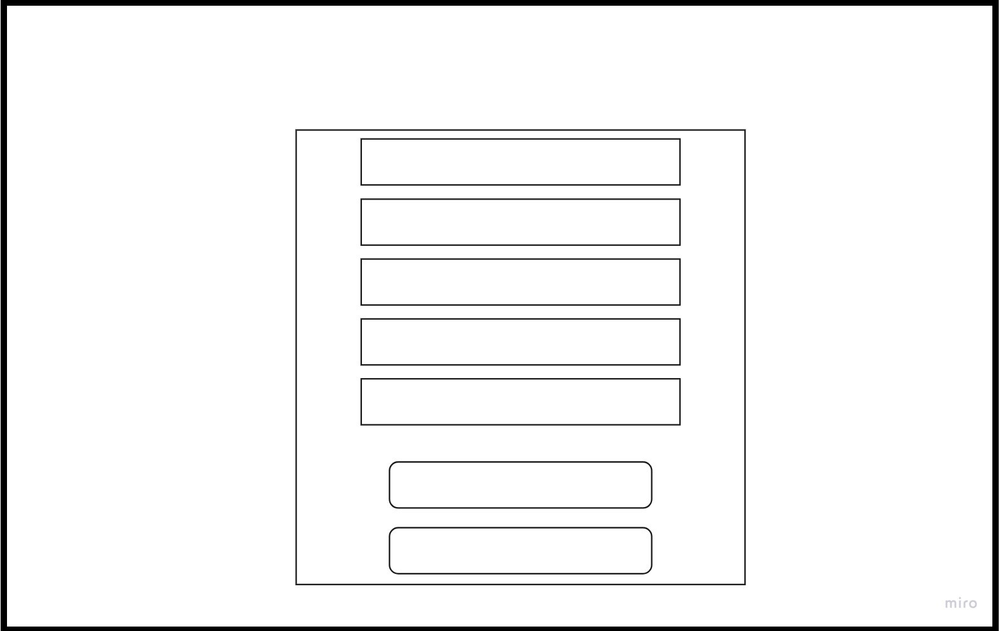
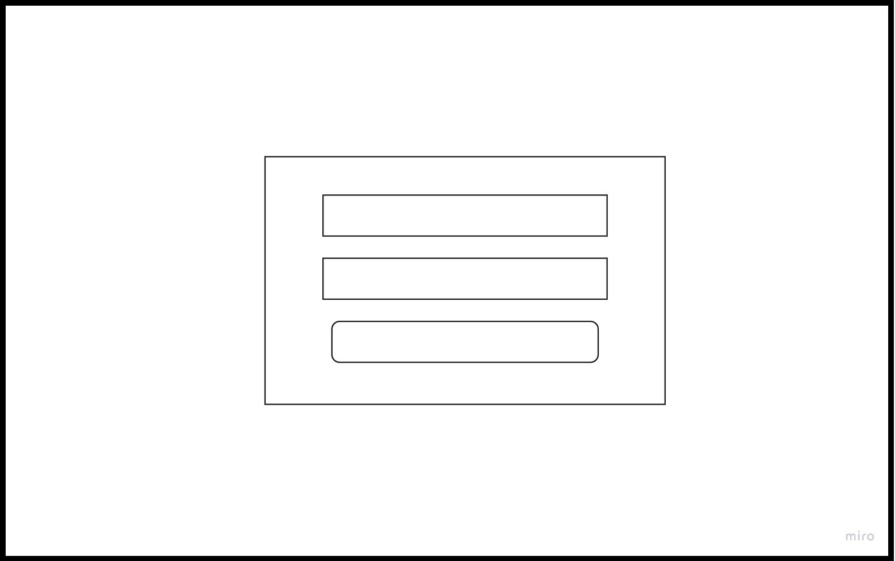
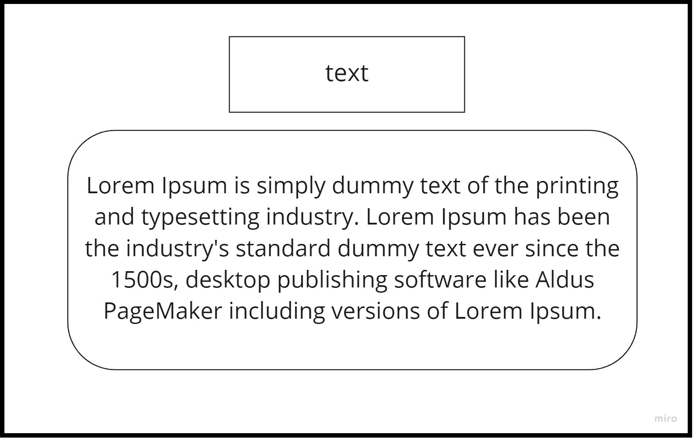
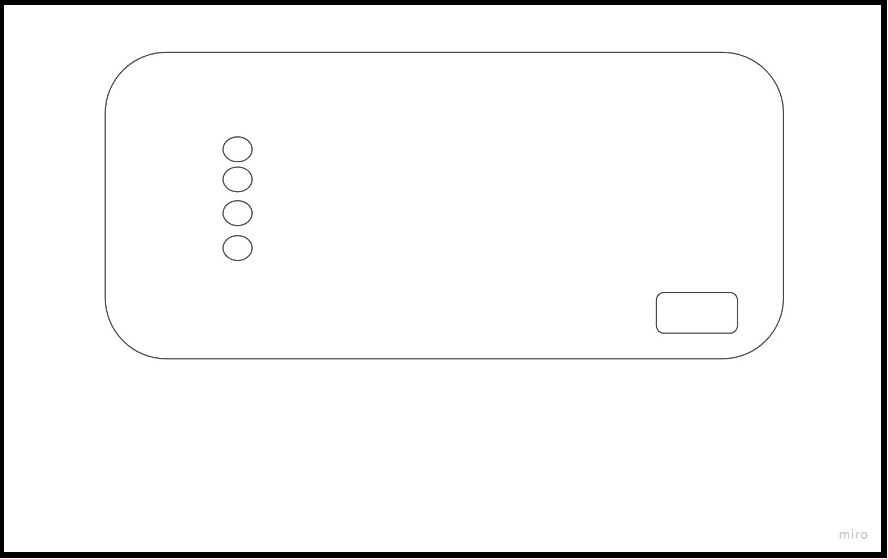
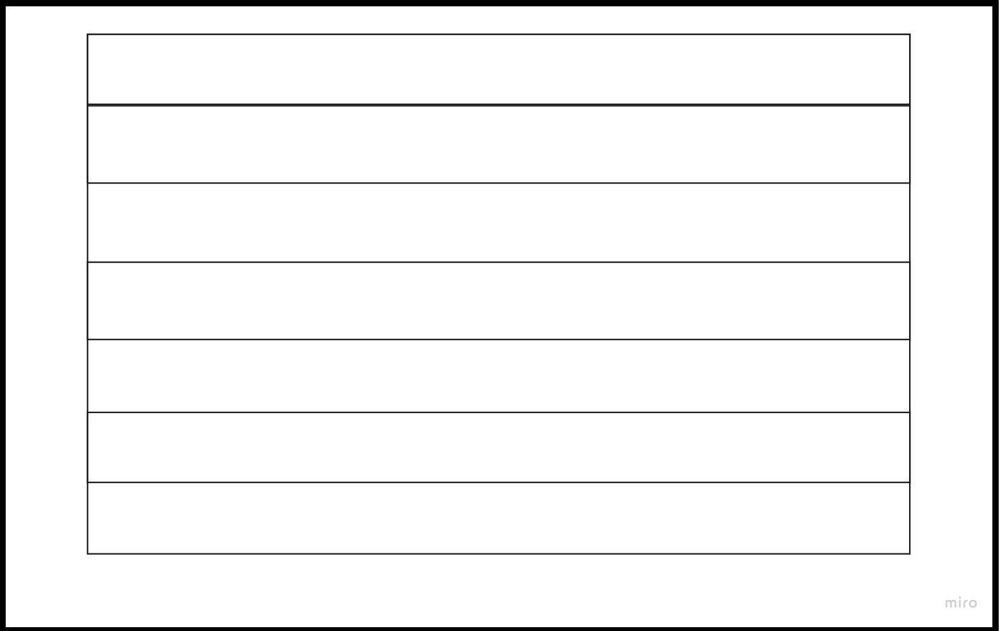
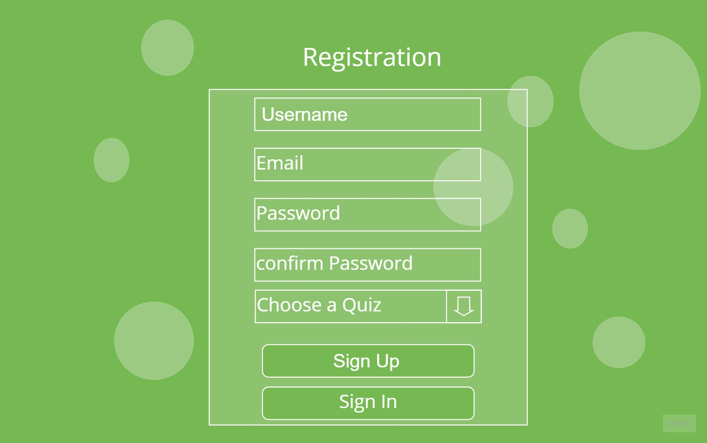
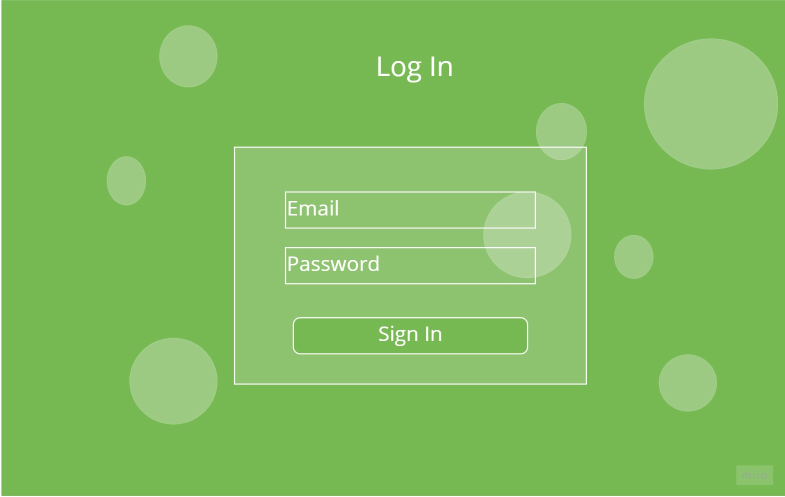
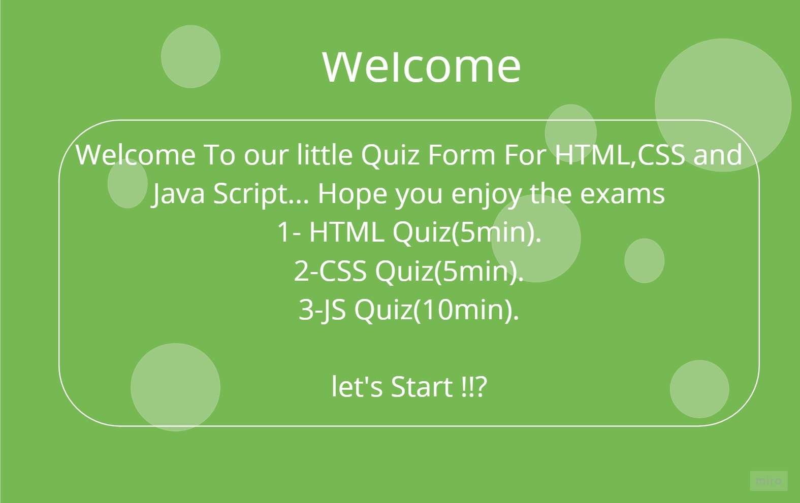
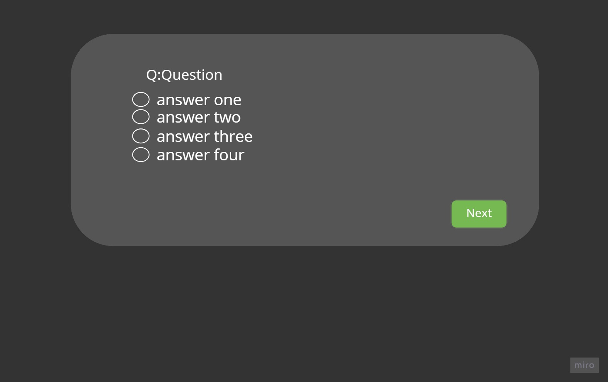
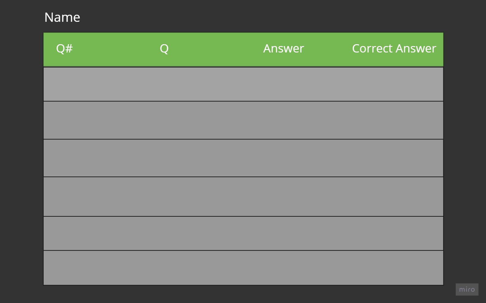

# project2 : Online Quiz Website
#### welcome to our project repo link :) this project is aiming to create a rfully responsive online qiuz page for emplouing requirements in coding field , you will find three types of exams (HTML exam,CSS exam an JavaScript exam) for various position examinite .  the structur is six pages including Home Page,Register Form,Login Form,Questions square and finally Result table.
# this project was made by :

- *Taebah Shlouh(https://github.com/taebah-alshlouh)*
- *Sara Kteifan(https://github.com/SaraKteifan)*
- *Anas Allawafeh(https://github.com/10-anasAllawafeh)*
# wireframe

# mockup

# Project Live Link
[live](https://taebah-alshlouh.github.io/project2/)

# Project GitHub Link

[Github](https://github.com/taebah-alshlouh/project2)

